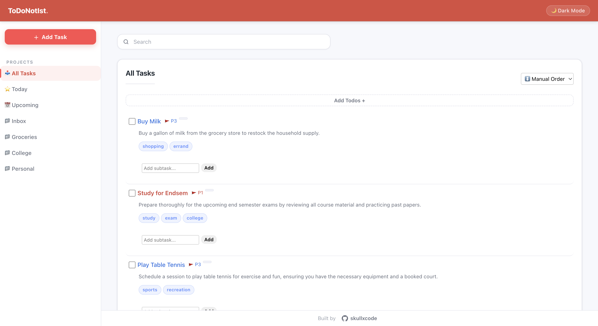
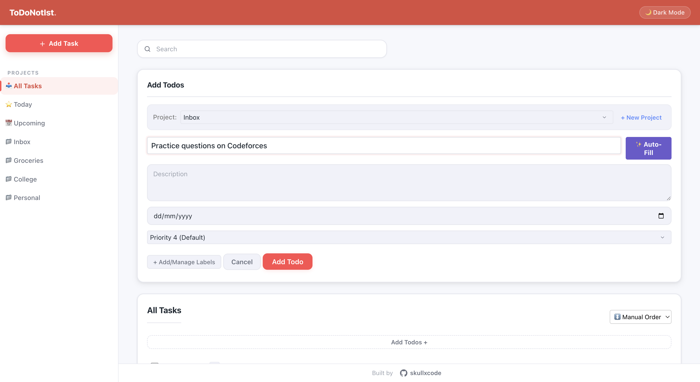
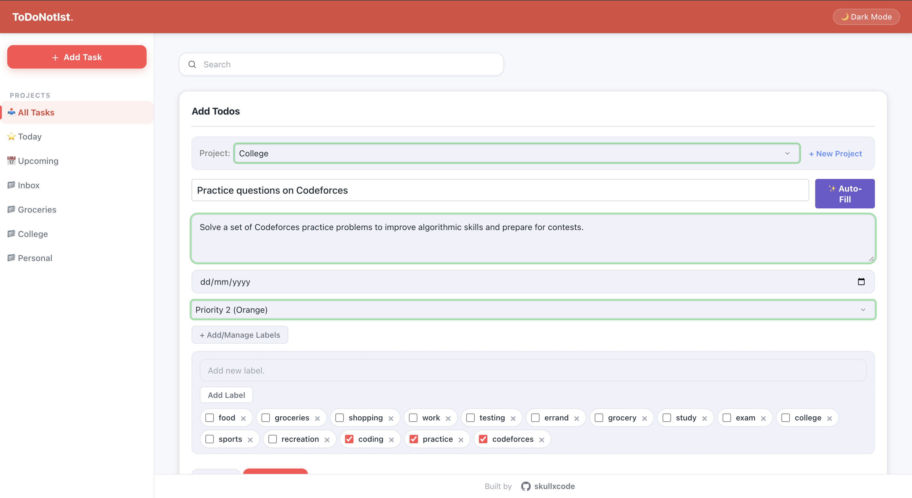
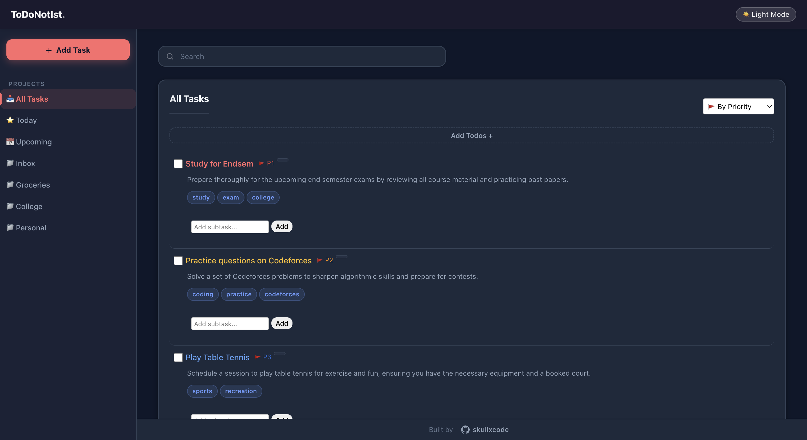

# 📝 TodoNotIst

A Todoist-inspired task management application built with vanilla HTML, CSS, and JavaScript, enhanced with AI-powered task enrichment via an n8n automation workflow.

---

## 📌 Overview

TodoNotIst is a fully client-side task management application that runs entirely in the browser, persisting data via `localStorage` — no backend server required for core functionality.

Its defining feature is the **✨ Auto-Fill** integration: when a user types a task title and clicks the button, a POST request is dispatched to an n8n webhook. An LLM (via Groq) analyzes the task and returns structured JSON containing a suggested description, priority level, project assignment, labels, and subtasks. The form fields are then populated automatically, with a brief visual flash on each updated element.

The project was built to demonstrate practical integration between a lightweight vanilla JS frontend and a no-code automation backend.

---

## 🌐 Live Demo

**[https://skullxcode.github.io/TodoNotIst/](https://skullxcode.github.io/TodoNotIst/)**

> **Note:** The Auto-Fill feature requires a running n8n instance configured with the included workflow. See [Installation](#-installation) for setup details.

---

## ✨ Features

**Task Management**
- Create, edit, and delete tasks with title, description, due date, and priority
- Mark tasks as complete or restore them to active
- Add subtasks to break down complex items
- Organize tasks into custom **projects** via a sidebar
- Assign one or more **labels** per task
- Bulk-clear all completed tasks

**Views & Filtering**
- View all tasks, or filter by project, **Today**, or **Upcoming** (next 7 days)
- Real-time search across all tasks
- Sort tasks by priority, due date, alphabetical order, or manual drag-and-drop

**AI Automation (n8n)**
- **Auto-Fill** — submits the task title to an n8n webhook; an LLM returns and populates priority, description, project, labels, and subtasks
- Visual flash feedback on each auto-filled field
- Toast notifications indicating success or connection failure

**UI / UX**
- Dark mode and light mode with persistent preference via `localStorage`
- Keyboard shortcuts: `N` (new task), `/` or `Ctrl+K` (focus search), `Esc` (cancel/close)
- Due date display with relative formatting: "Today", "Tomorrow", "Overdue"
- Browser-based due date reminders (alert, 24 hours before due)
- Fully responsive layout for desktop and mobile

---

## 🛠️ Tech Stack

| Technology | Role |
|---|---|
| **HTML5** | Application structure and markup |
| **CSS3** | Styling, theming, dark mode via CSS variables |
| **JavaScript (ES6+)** | Application logic — state management, rendering, events, drag-and-drop |
| **n8n** | Workflow automation — receives task data via webhook, invokes an LLM, and returns enriched task metadata |
| **Groq (via n8n)** | LLM inference provider used within the n8n LangChain node |
| **localStorage** | Client-side data persistence; no backend required |

---

## 📦 Installation

### Prerequisites

- A modern web browser
- [n8n](https://docs.n8n.io/hosting/) (local or cloud) — required only for the Auto-Fill feature
- A [Groq API key](https://console.groq.com/) — required only for the Auto-Fill feature

---

### 1. Clone the Repository

```bash
git clone https://github.com/skullxcode/TodoNotIst.git
cd TodoNotIst
```

### 2. Open the Application

The app requires no build step. Open `index.html` directly in a browser:

```bash
open index.html
```

Or serve it locally using VS Code Live Server or any static file server:

```bash
npx serve .
```

The application is fully functional for task management at this point. Tasks are persisted to `localStorage`.

---

### 3. Configure n8n (Auto-Fill Feature)

#### Start n8n

**Via npm:**
```bash
npm install -g n8n
n8n start
```

**Via Docker:**
```bash
docker run -it --rm \
  --name n8n \
  -p 5678:5678 \
  -v ~/.n8n:/home/node/.n8n \
  n8nio/n8n
```

n8n will be available at `http://localhost:5678`.

#### Import the Workflow

1. Open the n8n dashboard
2. Navigate to **Workflows → Import from File**
3. Select `n8n.json` from the project root
4. Open the **Groq Chat Model** node and add your Groq API credentials
5. Click **Activate** to enable the workflow
6. Copy the **Webhook URL** from the `Webhook (POST)` node

#### Point the App at Your Webhook

Open `script.js` and update the webhook constant near the bottom of the file:

```javascript
const N8N_WEBHOOK_URL = "https://your-n8n-instance/webhook/categorize-task";
```

---

## 📸 Screenshots

| Screenshot | Description |
|---|---|
|  | Main task dashboard with sidebar project navigation |
|  | Task creation form with Auto-Fill button |
|  | Form fields populated after AI enrichment |
|  | Dark mode interface |

---

## 🧠 Architecture & Workflow

```
User types a task title → clicks ✨ Auto-Fill
        │
        ▼
Frontend sends POST to n8n Webhook
{ task: "...", availableProjects: [...] }
        │
        ▼
n8n: LangChain node constructs a structured prompt
        │
        ▼
Groq LLM returns strict JSON:
{ projectId, priority, description, labels[], subtasks[] }
        │
        ▼
n8n: Respond to Webhook node returns parsed JSON
        │
        ▼
Frontend populates form fields + flashes updated elements
```

The n8n workflow consists of four nodes:

| Node | Purpose |
|---|---|
| `Webhook (POST)` | Receives task payload from the frontend |
| `Webhook (OPTIONS)` | Handles CORS preflight requests |
| `AI Logic` (LangChain) | Constructs the prompt and invokes the Groq model |
| `Respond to Webhook` | Parses and returns the JSON response to the frontend |

All core task management (CRUD, filtering, sorting, persistence) runs entirely client-side with no external dependencies.

---

## 🔮 Future Improvements

- [ ] User authentication and cloud-based data persistence (e.g., Supabase or Firebase)
- [ ] Email or Slack notifications via n8n notification nodes
- [ ] Google Calendar integration for due date synchronisation
- [ ] Progressive Web App (PWA) support for offline use and installability
- [ ] Productivity analytics — task completion rates, overdue trends
- [ ] Docker Compose configuration for single-command local stack setup
- [ ] Unit and integration test coverage (Jest)
- [ ] Configurable n8n webhook URL via a settings panel in the UI

---

## 🤝 Contributing

Contributions are welcome. To propose a change:

1. Fork the repository
2. Create a feature branch: `git checkout -b feature/your-feature`
3. Commit your changes: `git commit -m "feat: describe your change"`
4. Push the branch: `git push origin feature/your-feature`
5. Open a Pull Request

Please follow the [Conventional Commits](https://www.conventionalcommits.org/) specification for commit messages.

---

## 📄 License

This project is licensed under the [MIT License](./LICENSE).